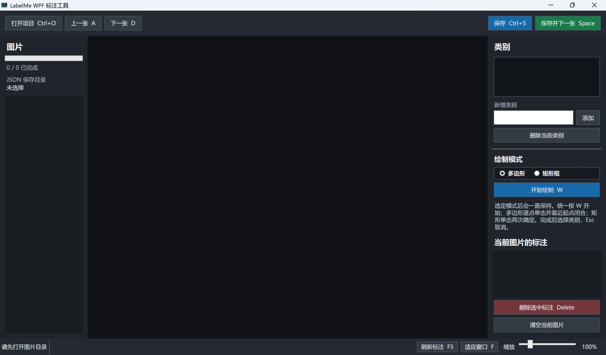

# LabelMe WPF 标注工具

一个使用 WPF / C# 编写的本地图片多边形标注工具，无需 OpenCV。



## 使用 BAT 编译

双击 `build.bat`，或者在终端运行：

```bat
build.bat
```

默认编译 Release，也可以指定配置：

```bat
build.bat Debug
build.bat Release
```

编译结果位于：

```text
dist\Release\LabelMeWpf.exe
```

## 使用 CMake 编译

```powershell
cmake -S . -B build/cmake -DDOTNET_CONFIGURATION=Release
cmake --build build/cmake --config Release --target LabelMeWpf
```

CMake 还提供 `run` 目标，可以在编译后启动程序：

```powershell
cmake --build build/cmake --target run
```

> CMake 负责配置和驱动构建，WPF/C# 源码仍由 .NET SDK 编译。需要安装 CMake 和 .NET 9 SDK。

## 标注操作

1. 点击“打开项目”，先选择包含 JPG、PNG、BMP 或 TIFF 图片的目录。
2. 再选择独立的 JSON 保存目录；标注、进度和类别配置只写入该目录，图片目录保持不变。
3. 在右侧输入类别并点击“添加类别”，或在完成形状后的弹窗中新增类别。
4. 先选择“多边形”或“矩形框”模式；模式会一直保持，统一按 `W` 开始绘制。
5. 多边形使用左键逐点添加并靠近起点闭合；矩形框用两次单击确定两个角点。
6. 形状完成后会弹出类别窗口，可双击已有类别直接确认，也可以单击类别后按“确定”或直接输入新类别；按 `F` 可让图片重新适应窗口。
7. 点击图片中的框会选中右侧对应标注；点击右侧标注也会高亮图片中的框。
8. 靠近并拖动已有顶点可修改形状，`Delete` 删除右侧选中的标注。
9. `Ctrl+S` 保存，或按 `Space` 保存并进入下一张。

已完成的形状只显示轮廓，不填充遮罩。右击图片中的形状可以修改类别或删除标注。

按住 `Ctrl` 滚动鼠标滚轮可围绕鼠标位置缩小或放大图片；不按 `Ctrl` 时滚轮用于普通滚动。

程序会监听 JSON 目录中的新增、修改和删除并自动更新标注与进度。也可以按 `F5` 手动刷新；如果当前图片有未保存内容，重新加载前会先询问。

每张图片的标注以同名 `.json` 保存到指定 JSON 目录。该目录下的 `.labelme-wpf-progress.json` 记录已完成图片、当前位置和预设类别。
